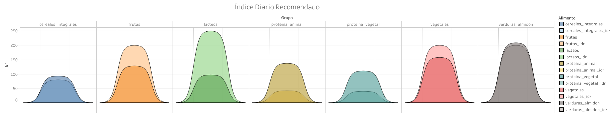

```{r setup, include=FALSE}
knitr::opts_chunk$set(echo = TRUE)
```

# Introducción

El siguiente manual tiene como objetivo explicar el uso de funciones en R studio y Tableau para generar tablas y gráficos que permitan comparar el índice diario recomendado (idr) en México con el consumo promedio reportado a partir de los datos de ENSANUT 100k 2018 e EAT-Lancet. La información se divide en dos apartados, el primero explicando las funciones de R y el segundo describe como utilizar la información obtenida y desarrollar el gráfico en Tableau.



## Rstudio

A partir de R studio obtendremos las tablas con idr reportado por ENSANUT e EAT-Lancet. Esto a partir de las siguientes funciones

```{r idr, eval=FALSE}
idr_ensanut()
idr_eat_lancet()
```

Ambas funciones se utilizan de forma directa, sin argumentos. Generando como salida una tabla conformada por los 7 grupos de alimentos, el idr, el consumo promedio en poblacion mexicana y el grupo de alimento al que pertenecen. A continuación se muestra una serie de comandos para visualizar los datos de salida que genera cada función


```{r tabla, echo=TRUE}
# correr los siguientes argumentos para ver ejemplo
# idr_ensanut_table <- idr_ensanut()
# idr_ensanut_table

# idr_eat_table <- idr_eat_lancet()
# idr_eat_table
```

De la misma manera, se puede filtrar el consumo promedio de los siete grupos de alimentos por zona (centro, sur, norte, cdmx) y compararlo con el idr de ENSANUT e EAT-Lancet. Para esto se utilizan las siguientes funciones:

```{r idr2, eval=FALSE}
idr_ensanut_zone()
idr_eat_lancet_zone()
```

Ambas tienen el argumento *zone*, el cual permite filtrar los datos para cada zona.

```{r ejem2, eval=FALSE}
# correr los siguientes ejemplos
# idr_ensanut_norte <- idr_ensanut_zone(zone = "norte")
# idr_ensanut_norte

# idr_eat_norte <- idr_eat_lancet_zone(zone = "norte")
# idr_eat_norte
```

Con estas funciones se obtine la información de trabajo. Guarda el resultado de cada una con la función *write.csv()*. Esto te permitirá terminar la evaluación de la infromación.

## Tableau

Para este apartado es necesario hacer un usuario y descargar la aplicación de ***[Tableau Public](https://public.tableau.com/en-us/s/)*** en tu computadora de trabajo.


Una vez realizada la actualización abrir Tableau y cargara archivo *.csv* . En el editor de datos pegar el siguiente comando, esto nos ayudará a crear los bins para el gráfico.

```{r ta1, eval=FALSE}
Path
0
200
```

Este argumento debe generar un error. Por lo cual debemos agregar un apartado de unión entre nuestros datos. Esto se realiza conla función *Add new join clause* igualando a 1 en ambos data sets.

<< 1 = 1 >>


A continuación, nos dirigimos a Sheet 1 para comenzar a generar las fórmulas para manipular los datos y generar el gráfico.


*Calcular campo de distancia*

### Distance

Analysis >> Created Calculated Field

Name as **Distance**

Data type to **Integer**

Current value to **10**

OK


**Crear Path(bin)**

Click derecho en Path >> Create >> Bins

New Field name to Path(bin)

Size of bins to 1

OK


**Index**

Analysis >> Created Calculated Field

```{r ind, eval=FALSE}
-6+((INDEX()-1)*0.12)
```


**TC_Value**

Analysis >> Created Calculated Field

```{r tc, eval=FALSE}
WINDOW_MAX(MAX([freq]))
```


**Y**

```{r Y, eval=FALSE}
IF [Index] <= 6 THEN
    (1/(1+EXP(-[Index])))
ELSE
    (1/(1+EXP(-(12-[Index]))))
END
* [TC_Value]
```


**TC_alimento Rank**

```{r tc_alimento, eval=FALSE}
RANK_UNIQUE([TC_Value])
```


**X**

```{r x, eval=FALSE}
[Index]+([TC_alimento Rank]*[Distance])
```

